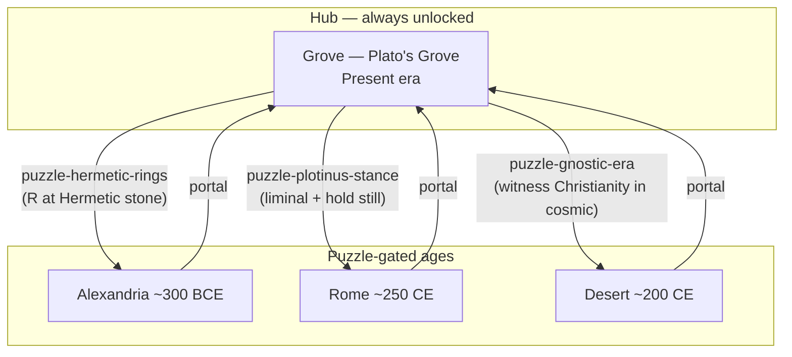
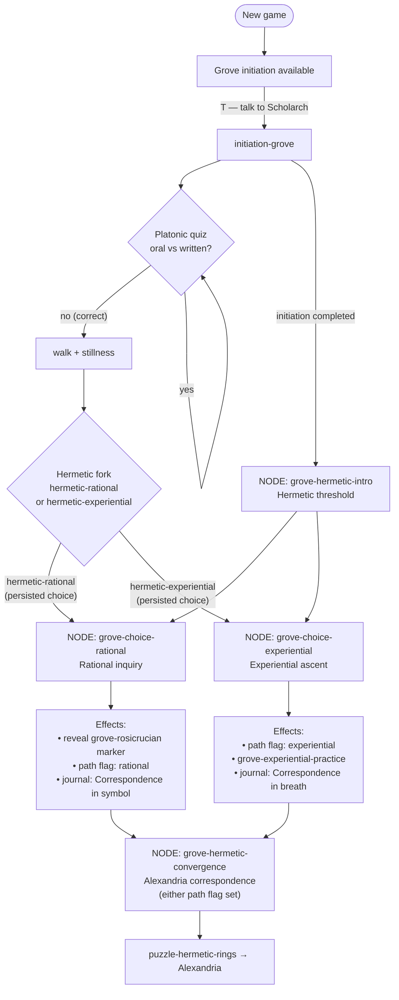
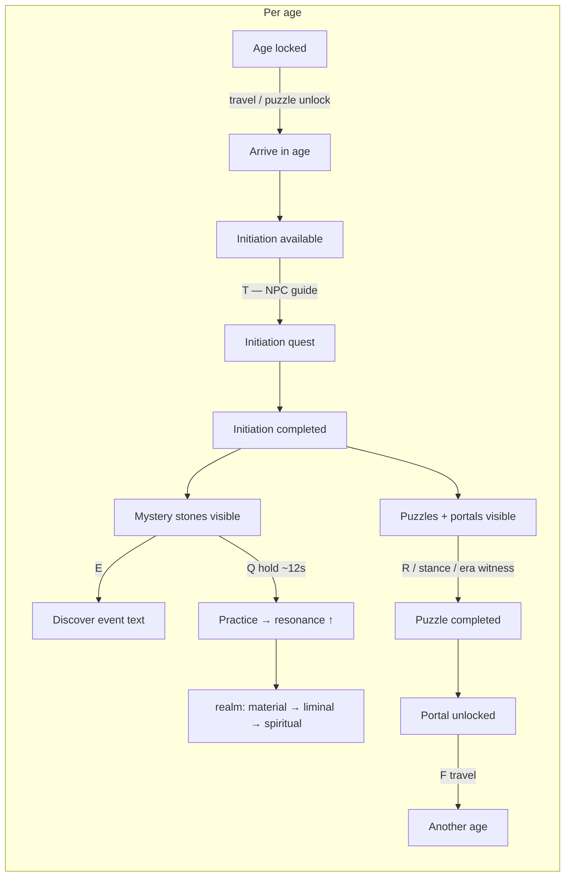
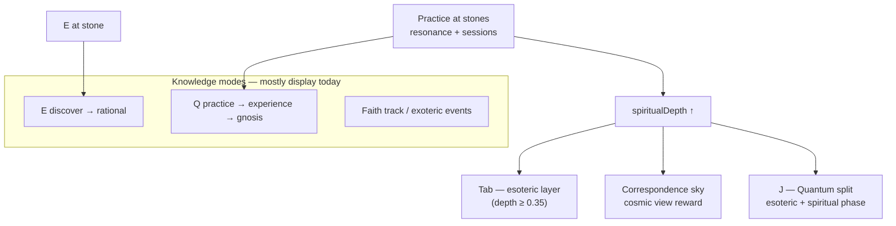
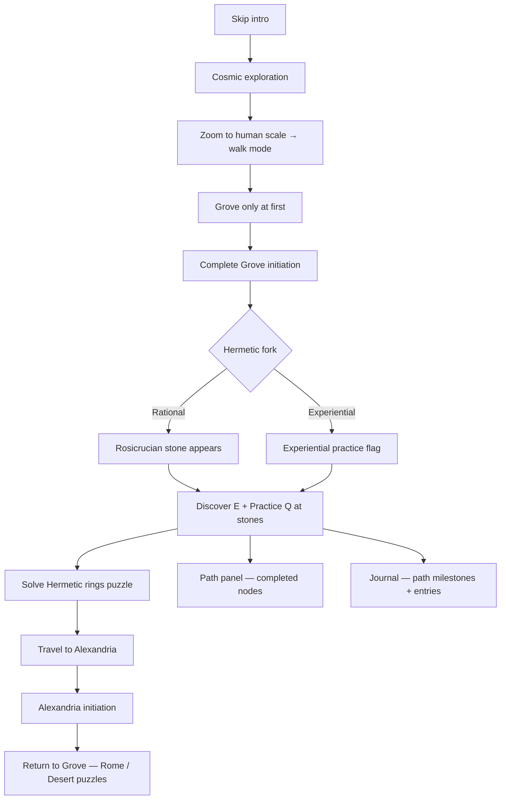

# Cosmos game tree

Current player progression as implemented in the repo. The formal **progression graph** (`src/data/progression/`) sits on top of the original hub-and-spoke age network.

**Related:** [content-authoring.md](./content-authoring.md) · [progression-backlog.md](./progression-backlog.md) · [historical-earth-view.md](./historical-earth-view.md) *(planned)*

---

## 1. World network (ages + puzzle gates)

All ages link back to **Grove** (always unlocked). Other ages unlock only after their puzzle is solved.

| Puzzle | Type | Trigger | Unlocks |
|--------|------|---------|---------|
| `puzzle-hermetic-rings` | ring-alignment | **R** near Hermetic stone | Alexandria |
| `puzzle-plotinus-stance` | threshold-stance | Liminal phase + hold still at Plotinus stone | Rome |
| `puzzle-gnostic-era` | era-witness | Witness `christianity` in cosmic timeline | Desert |

---

## 2. Formal progression graph (save v3)

Persisted fields: `choiceHistory`, `completedProgressNodeIds`, `pathFlags`, `activePathId`, `revealedMarkerIds`.

Only the **Grove Hermetic arc** is defined today (`src/data/progression/nodes/grove-hermetic.ts`).

### Progress nodes (current)

| Node ID | Title | Requires | Effects |
|---------|-------|----------|---------|
| `grove-hermetic-intro` | Hermetic threshold | Grove initiation completed | — |
| `grove-choice-rational` | Rational inquiry | Intro + choice `hermetic-rational` | Reveal Rosicrucian marker, path `rational`, journal entry |
| `grove-choice-experiential` | Experiential ascent | Intro + choice `hermetic-experiential` | Path `experiential`, practice flag, journal entry |
| `grove-hermetic-convergence` | Alexandria correspondence | Path flag `grove-hermetic-path` set | — (puzzle gate still separate) |

---

## 3. Per-age loop

Same pattern in Grove, Alexandria, Rome, and Desert:

| Age | NPC | Initiation | Markers | Puzzle from Grove |
|-----|-----|------------|---------|-------------------|
| Grove | Scholarch | Platonic + Hermetic fork | 6 (1 hidden until rational path) | Hermetic rings → Alexandria |
| Alexandria | Serapeum Keeper | Hermetic purification | 3 | — |
| Rome | Plotinus disciple | Neoplatonic ascent | 2 | Plotinus stance → Rome |
| Desert | Anchorite | Gnostic threshold | 2 | Gnostic era → Desert |

---

## 4. Parallel vertical tracks

Not wired into `ALL_PROGRESS_NODES` yet — they run alongside the age tree:

Tradition gates (`src/core/traditionGates.ts`) affect **correspondence sky**, not which ages or progress nodes unlock.

---

## 5. End-to-end player journey

---

## Not in the tree yet

Planned in [progression-backlog.md](./progression-backlog.md), not implemented as progress nodes:

- Alexandria / Rome / Desert initiation branches
- Kabbalah path from Grove Zohar stone
- Convergence node → puzzle hint journal entries
- New ages (Byzantium, Cordoba, etc.)
- Post-initiation NPC dialogue trees
- Knowledge-mode gates on specific nodes

---

## Key source files

| System | Location |
|--------|----------|
| Progress nodes | `src/data/progression/` |
| Evaluator | `src/core/progression/evaluateProgress.ts` |
| Save v3 | `src/core/save/saveSchema.ts` |
| Ages + puzzles | `src/data/ages/` |
| Initiations | `src/data/initiations/` |
| Path UI | `src/ui/PathPanel.tsx` |
