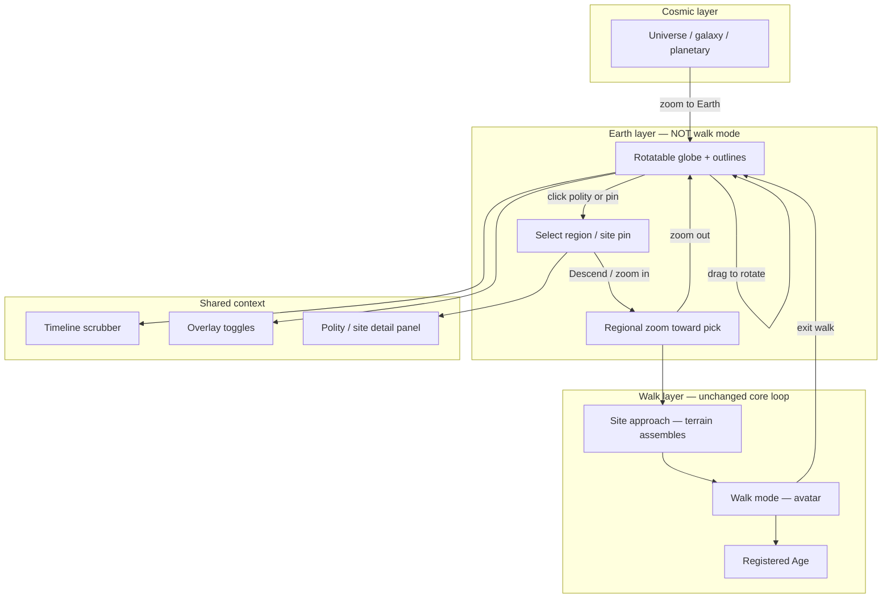

# Historical Earth view (planning)

**Status:** Vision / architecture sketch — not on the near-term roadmap.  
**Related:** [FUTURE_IDEAS.md](../FUTURE_IDEAS.md) · [game-tree.md](./game-tree.md) · Myst/Riven plan (`.cursor/plans/myst-riven_dual_world_84330404.plan.md`)

---

## Vision

A **dedicated Earth globe view** — separate from walk mode — where the player rotates the planet, scrubs time, reads country/culture outlines and overlays, **chooses where to go**, then zooms down through regional scale into the existing site-approach and walk layers.

Walk mode is the **final** step, not the Earth view itself.

```
Cosmic  →  Earth globe  →  Regional descent  →  Site approach  →  Walk mode (Age)
  ↑           ↑                  ↑                   ↑                 ↑
universe   rotate + pick     chosen lat/lng     terrain assembles   avatar + stones
           polity outlines    zoom toward pin    embodiment weight   WorldRegistry
           scrub timeline
```

### Earth view ≠ walkable view

| Layer | What you see | What you do | `ObserverState` sketch |
|-------|--------------|-------------|------------------------|
| **Cosmic** | Starfield, heavens, deep-time markers | Zoom toward Earth | `mode: 'cosmic'`, high `spatialExponent` |
| **Earth globe** | Whole planet, landmask, polity/culture outlines, site pins | **Rotate**, scrub time, toggle overlays, **click a region to select destination** | `mode: 'earth'` *(new)* |
| **Regional descent** | Curved patch / local tangent view zooming toward selection | Scroll zoom into chosen area; outlines gain detail | `mode: 'earth'`, `earthPhase: 'descent'`, `geoFocus` set |
| **Site approach** | Walkable terrain visible below, not yet embodied | Same as today’s “ground assembles” prompt | `mode: 'cosmic'`, `spatialExponent` in approach range, `geoFocus` locked |
| **Walk mode** | Local Age terrain, avatar, stones, NPCs | E / Q / T / puzzles | `mode: 'embodied'` |

Today the **human spatial band** (`ScaleSpace` exponent roughly −2…6) collapses globe, region, approach, and walk into one continuous zoom. The plan introduces an explicit **Earth mode** so the player can orbit and choose *before* committing to a descent — not auto-fall through to Grove terrain on zoom alone.

**Design constraints (carry forward from Cosmos):**

- Geometric / symbolic visuals — no photoreal globe or satellite imagery.
- Overlays are **interpretive lenses**, not authoritative history sims (same principle as correspondence sky vs ephemeris).
- Walk mode remains the core loop; the Earth globe is **navigation and context**, not gameplay itself.
- Content is **data-driven** — new places and eras should be registry entries, not core rewrites.
- **Descent is intentional** — entering walk requires a chosen `geoFocus` (click + confirm, or zoom past threshold *toward that pin*), not merely crossing a spatial exponent.

---

## What exists today

| Capability | Location | Gap for Earth view |
|------------|----------|-------------------|
| Shared timeline | `simTimeSeconds`, `ObserverState`, timeline UI | Events are global, not placed on a map |
| Spatial zoom bands | `TimeSpace.ts`, `spatialExponent`, `ScaleSpace.ts` | Planetary → terrestrial → human is one continuous zoom; no distinct globe mode |
| Walk entry | `embodiment.ts`, `WalkApproachPrompt`, `RealmTransitionSync` | Triggers on zoom depth + present-era time only; no geo selection step |
| Historical events | `src/data/history/*.ts` | Point events with optional `spatialBand`; no geography |
| Playable Ages | `src/data/ages/*.ts`, `WorldRegistry` | Each Age has `simTimeSeconds` but no map anchor |
| Spiritual overlays | tradition filters, correspondence sky | Per-sky, not per-map |
| Progression / puzzles | progression graph, `puzzle-gnostic-era` (era-witness) | Witness is timeline-based, not map-based |

**Key architectural gap:** Ages live in abstract local coordinates (`spawn`, `markers[].position`). There is no **georeference** linking Alexandria the Age to Alexandria the place on Earth at ~300 BCE.

---

## Player flow (target)



1. **Enter Earth globe** — zoom cosmic view to planetary scale, or use an explicit “Earth” control. Camera switches to an **orbit rig** around a symbolic globe (not the flat walk terrain).
2. **Rotate** — drag to spin the globe; scroll adjusts distance (whole-planet ↔ continental). Rotation is free; timeline scrub does not auto-spin.
3. **Scrub time** — same playhead as today; outline polygons interpolate for the current `simTimeSeconds`.
4. **Toggle overlays** — conflict, religion, governance, etc. (see below).
5. **Choose destination** — click a polity, site pin, or map marker → detail panel + **`geoFocus`** stored (lat/lng, optional `siteAnchorId`). Unplayable regions still selectable for lore; playable sites show “Descend” when time + unlock match.
6. **Descend** — player confirms or zooms past threshold **toward** `geoFocus` (not generic zoom). Camera leaves orbit rig, dives through regional scale; `WorldRegistry` resolves Age from anchor + time.
7. **Site approach** — reuse `embodimentApproachWeight` / “ground assembles” UX; terrain is the **local Age patch**, not the globe mesh.
8. **Walk** — same embodied mode as today (`mode: 'embodied'`).
9. **Return** — exit walk restores **Earth globe** at prior rotation, scrub time, and `geoFocus` (not a generic cosmic zoom).

### Spatial scale stack (proposed)

Relates new Earth navigation to existing `SPATIAL_BANDS`:

| Exponent range (approx.) | Band | View | Interaction |
|--------------------------|------|------|-------------|
| 16 – 12 | Planetary | Earth as distant marble | Zoom in → hand off to globe mode |
| 12 – 8 | **Earth globe** | Full sphere, country/culture outlines | **Rotate**, scrub, pick destination |
| 8 – 6 | Regional descent | Tangent patch / magnified outline | Zoom toward `geoFocus`; outlines → terrain hint |
| 6 – 4.5 | Site approach | Local terrain visible below | Existing approach prompt |
| 4.5 – 4 | Walk entry | Embodied | Existing `shouldEnterEmbodied` rules (+ historical branch) |

Implementation option: **`mode: 'earth'`** owns exponent 8–12 regardless of band id; **`geoFocus`** required before exponent can drop below ~8 toward walk.

---

## Terminology by era (what the map “shows”)

The base layer label and polygon semantics should change with time so the map stays honest without pretending modern nation-states exist in the Neolithic.

| Era (approx.) | Base layer term | Example entities |
|---------------|-----------------|------------------|
| 300 ka – 12 ka | **Cultures** (archaeological) | Regional tool traditions, migration corridors |
| 12 ka – 3 ka | **Cultures / early polities** | Fertile Crescent villages, Norte Chico, Indus |
| 3 ka – 500 BCE | **Polities & empires** | Old Kingdom Egypt, Akkad, Shang, Mycenae |
| 500 BCE – 1500 CE | **States, empires, faith realms** | Hellenistic kingdoms, Rome, Caliphates, Song |
| 1500 CE – present | **Countries & empires** (still symbolic) | Colonial boundaries, modern states (simplified) |

UI copy can say “Culture” in deep prehistory and “Country” only when the data model uses modern-ish borders — one slider, shifting vocabulary.

---

## Overlay lenses (optional toggles)

Overlays sit **on top of** the base polity/culture layer. Each is a separate data track with its own simplification rules.

| Overlay | Visual sketch | Primary data |
|---------|---------------|--------------|
| **Conflict** | Hatching, pulse markers, broken-border segments | Wars, invasions, collapses (`MaterialEvent` + new `ConflictSpan`) |
| **Religion / tradition** | Soft color washes, tradition glyphs from existing palette | `SpiritualEvent`, `SpiritualTradition` |
| **Governance** | Border style + icon (city-state, empire, tribal, theocracy) | `GovernanceKind` enum on polity snapshots |
| **Trade / connectivity** | Great-circle arcs, dotted routes | Optional; links known Ages and historical events |
| **Knowledge / correspondence** | Unlocked after practice — esoteric highlights on map | Ties to Phase 8b+ correspondence lens |

Overlays should default **off** except the base layer; turning on “Religion” might tint regions where linked spiritual events are active at the scrubbed time.

---

## Data model (sketch)

New content under `src/data/earth/` (names tentative):

```typescript
/** WGS84-ish; used for map placement only — Ages keep local x/z terrain coords */
interface GeoAnchor {
  lat: number;
  lng: number;
  label: string;
}

/** One footprint at one instant or span of sim time */
interface PolitySnapshot {
  id: string;
  polityId: string;
  simTimeStart: number;
  simTimeEnd: number;
  /** GeoJSON-like rings in lng/lat — keep low vertex count */
  rings: [number, number][][];
  displayName: string;
  kind: 'culture' | 'polity' | 'empire' | 'state';
  governance?: 'tribal' | 'city-state' | 'kingdom' | 'empire' | 'caliphate' | 'republic' | 'colony';
  linkedEventIds?: string[];
}

/** Links map to playable content */
interface SiteAnchor {
  id: string;
  geo: GeoAnchor;
  /** Nearest Age if any; null = timeline-only marker */
  ageId?: string;
  /** Age loads when scrub time within window */
  simTimeStart: number;
  simTimeEnd: number;
  approachEventId?: string; // optional witness / discover hook
}

interface ConflictSpan {
  id: string;
  simTimeStart: number;
  simTimeEnd: number;
  label: string;
  /** Simplified affected region ids or bbox */
  polityIds?: string[];
}
```

**Extend `AgeDefinition`** (non-breaking, optional fields):

```typescript
interface AgeDefinition {
  // ... existing fields ...
  geoAnchor?: GeoAnchor;
  /** Override default simTimeSeconds window for map “enter walk” */
  playableWindow?: { start: number; end: number };
}
```

Registry validation: if `geoAnchor` is set, `simTimeSeconds` should fall inside `playableWindow` or the anchor window.

---

## Rendering approach (phased)

Stay consistent with Cosmos geometry — think **interpretive atlas**, not Google Earth. The **globe is the hero** of the Earth layer; flat projections are debug-only.

| Phase | Map representation | Notes |
|-------|-------------------|--------|
| **E0 — Globe MVP** | Low-poly sphere, landmask, colored polity outlines, orbit camera | Rotate + click + one timestamp |
| **E1 — Scrub + pick** | Snapshot interpolation on sphere; site pins; `geoFocus` selection | Timeline drives outline morph |
| **E2 — Descent bridge** | Globe → tangent patch → existing terrain approach | Must not skip straight to walk |
| **E3 — Overlays** | Conflict / religion / governance compositor on sphere | Toggle lenses |
| **E4 — Correspondence cartography** | Post-practice stylistic shift on same globe | Parallel to `CorrespondenceSky` |

**Components** (likely `src/world/earth/`):

- `EarthGlobe` — sphere mesh, landmask, polity layers projected onto surface
- `EarthOrbitControls` — drag-rotate, inertia optional, clamp pitch so poles aren’t unusable
- `PolityLayer` — time-interpolated outline rings on the sphere
- `SitePinLayer` — playable / lore markers at `GeoAnchor`
- `EarthDescentTransition` — camera path from orbit to site approach
- `OverlayCompositor` — shader or stacked meshes for optional lenses

Driven by `ObserverState` (+ new `earth` fields) the same way `MaterialHeavens` reads `simTimeSeconds`.

---

## Integration with existing systems

### Timeline

- Reuse `simTimeSeconds` and the log-scale scrubber; no second clock.
- `spatialTimeCoupling.ts` already constrains visible time range by zoom band — Earth view lives entirely in the **human spatial band** with optional tighter coupling when focused on a region.

### Observer mode extension

Today: `ObserverMode = 'cosmic' | 'embodied'`.

Proposed additions to `ObserverState`:

```typescript
type ObserverMode = 'cosmic' | 'earth' | 'embodied';

interface GeoFocus {
  lat: number;
  lng: number;
  siteAnchorId?: string;
  ageId?: string;
}

// When mode === 'earth':
earthPhase?: 'globe' | 'descent';  // orbit vs diving toward geoFocus
geoFocus?: GeoFocus | null;          // null until player picks a destination
earthRotation?: { yaw: number; pitch: number }; // persist orbit orientation
```

- Enter **`earth`** from cosmic when zooming to planetary scale or via UI.
- Leave **`earth`** for `cosmic` only by zooming past Earth entirely — not when entering walk.
- **`embodied`** always implies a resolved `geoFocus` / Age (or Grove default for onboarding).

### Walk mode / Ages

- **`shouldEnterEmbodied`** today requires present-era time and generic human-band zoom. New rules: also require **`geoFocus` set**, descent phase complete, and for historical sites (b) scrub time within site window, (c) Age unlocked.
- Auto-enter walk on zoom alone should **not** happen from globe orbit — only after deliberate descent toward a pin.
- **`WorldRegistry.getAge(id)`** remains the loader; globe resolves `ageId` from `SiteAnchor` + time.
- Grove stays the **present-era hub**; historical Ages reachable from globe *or* portal graph.
- **`travelToWorld(ageId)`** runs during descent, before terrain approach (same as portal travel today).

### Progression & puzzles

- New puzzle type candidate: **`site-witness`** — scrub map to era + location (extends era-witness pattern).
- Path panel / journal can show “nearest playable site” from map selection.
- Locked Ages appear on map as faint outlines or “legend only” until puzzle clears.

### History content

- Existing `MaterialEvent` / `SpiritualEvent` entries gain optional `siteAnchorId` or lat/lng for map markers.
- Deep-time cosmic/geologic/biologic domains stay **non-geographic** — Earth view appears only in human band.

---

## Phased rollout

| Phase | Deliverable | Player-visible? | Depends on |
|-------|-------------|-----------------|------------|
| **E0 — Globe MVP** | Rotatable sphere, landmask, 5 polity outlines (300 BCE), 3 site pins, click → panel | Yes (dev flag) | `mode: 'earth'`, orbit controls |
| **E1 — Scrub + pick** | Outline interpolation; `geoFocus`; “Descend” affordance | Yes | E0 + snapshot lerp |
| **E2 — Descent → walk** | Globe dive → site approach → Age load; no skip to walk | Yes | `geoAnchor` on ages, embodiment rule change |
| **E3 — Overlays** | Religion + conflict toggles on globe | Yes | Overlay compositor |
| **E4 — Coverage** | More eras; culture/country terminology shifts | Content | Authoring pipeline |
| **E5 — Correspondence map** | Post-practice globe lens | Optional | tradition gates |

**Suggested first vertical slice:** Mediterranean ~300 BCE — Alexandria Age already exists; add Rome, Grove (present), placeholder polygons for Seleucid / Ptolemaic / Roman Republic footprints.

---

## Content authoring

1. **Polity snapshots** — coarse polygons (10–30 vertices max); prioritize readability over border accuracy.
2. **Site anchors** — one per playable Age minimum; optional extra markers for timeline-only events (e.g. Göbekli Tepe before an Age exists).
3. **Sources** — same pattern as history events: `sourceUrl` on polity metadata for panel links.
4. **Validation** — Vitest: snapshot time ranges don’t overlap inconsistently; every `ageId` on a site exists in registry; `geoAnchor` ages have puzzles/progression wired.
5. **E2E** — scrub to era → click site → embodiment prompt → walk in correct Age (flag-gated until stable).

See [content-authoring.md](./content-authoring.md) for test expectations when phases ship.

---

## Open decisions

| Question | Lean | Alternatives |
|----------|------|--------------|
| Flat map vs globe? | **Globe only** for player-facing Earth view; flat debug panel optional | Equirectangular preview for authoring |
| How to rotate? | Drag orbit (yaw/pitch), optional inertia | Fixed meridian, click-only — rejects exploration |
| Accidental walk entry? | Block `shouldEnterEmbodied` until `geoFocus` + descent | Keep today’s auto-enter — breaks globe UX |
| How accurate should borders be? | Symbolic / educational | GIS-accurate — high cost, fights aesthetic |
| Unplayable regions? | Show events + “no walkable site yet” | Hide until Age exists |
| Multiplayer / split? | Map shows material track only; astral stays Age-local | Astral footprints on map — far future |
| Present-day Grove on map? | Athens anchor, present window only | Abstract “everywhere” hub — breaks geography metaphor |
| Data source for polygons? | Hand-authored TypeScript packs | Import simplified GeoJSON — tooling later |

---

## Relationship to Myst/Riven arc

The shipped Myst/Riven plan (Phases 0–6) treats Ages as **linked books** with portal puzzles, not as map pins. The Earth view **does not replace** that graph — it **contextualizes** it:

- Portal network = esoteric / initiatory travel (inner connectivity).
- Earth map = exoteric / historical placement (outer geography).

Players might unlock Alexandria via Hermetic rings from the Grove *or* by finding Alexandria on the map at ~300 BCE after convergence — same Age, two doors. Puzzle design should avoid requiring 100% map coverage.

---

## Decision log

| Date | Decision |
|------|----------|
| 2026-06-28 | Document Earth view vision as phased atlas → descend → walk; georef Ages via optional `geoAnchor`; overlays as interpretive lenses; first slice Mediterranean ~300 BCE. |
| 2026-06-28 | Clarify Earth globe as **intermediate layer** (rotate, pick destination) distinct from walk mode; propose `mode: 'earth'`, `geoFocus`, intentional descent before site approach. |
