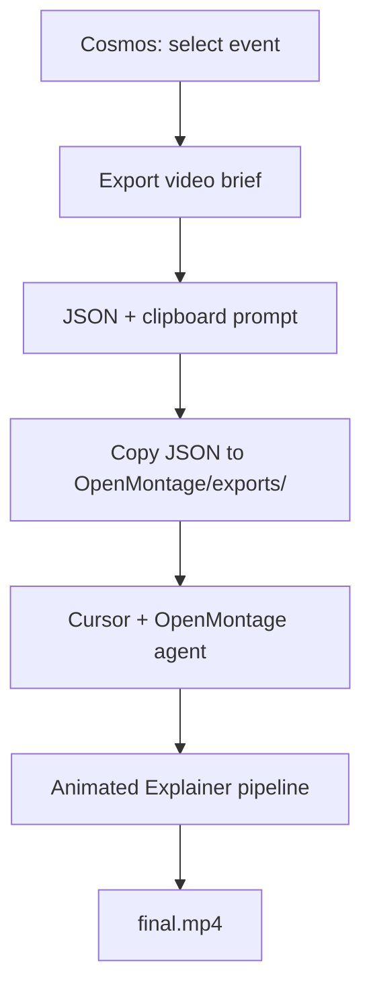

# Cosmos → OpenMontage Workflow

End-to-end steps to turn a Cosmos history event into an animated explainer MP4.

## Overview



## Step 1 — Export from Cosmos

1. Run Cosmos locally (`dev.cmd`) or use your [Vercel deploy](https://vercel.com/joey-mcnitts-projects).
2. Open any event in the detail panel (spiritual/esoteric events work best for contemplative tone).
3. Under **Video export (OpenMontage)**, pick **45s**, **60s**, or **90s**.
4. Click **Export video brief**.
5. Save the downloaded file (e.g. `cosmos-zohar-brief.json`). The OpenMontage prompt is copied to your clipboard when the browser allows it.

## Step 2 — Set up OpenMontage (one time)

From a parent folder that contains both repos:

```bash
git clone https://github.com/calesthio/OpenMontage.git
cd OpenMontage
make setup
```

Windows without `make`: see [OpenMontage README](https://github.com/calesthio/OpenMontage#install--run).

Copy `.env.example` to `.env`. No keys required for the free Piper + Remotion path.

## Step 3 — Install the brief

In the OpenMontage repo:

```bash
mkdir -p exports
cp /path/to/cosmos-zohar-brief.json exports/cosmos-zohar-brief.json
```

Or use the committed example:

```bash
cp ../Cosmos/tools/openmontage/examples/zohar-brief.json exports/cosmos-zohar-brief.json
```

## Step 4 — Run in Cursor

1. Open the **OpenMontage** folder in Cursor (not Cosmos).
2. Start a new agent chat.
3. Paste the `cursorPrompt` from the brief JSON (or the clipboard copy from Step 1).
4. Optionally attach `exports/cosmos-zohar-brief.json` to the chat.

Example prompt (abbreviated):

```
Using the OpenMontage Animated Explainer pipeline, produce a 60-second video
from the attached Cosmos brief. Use Piper TTS, Remotion image scenes,
contemplative pacing. Brief file: exports/cosmos-zohar-brief.json
```

The agent should:

- Read the Animated Explainer pipeline manifest
- Expand narration from each `sections[].narration`
- Generate or source visuals per `visualHint`
- Render via Remotion → MP4

## Step 5 — Collect output

OpenMontage writes to something like:

```
OpenMontage/projects/<project-name>/renders/final.mp4
```

Exact path depends on the project name the agent chooses. Check the agent’s checkpoint / summary for the file location.

---

## Verified pilot (Cosmos-side)

**Status:** Cosmos export validated; OpenMontage render is run locally by you.

| Step | Result |
|------|--------|
| `buildVideoBrief('zohar')` | Produces 5-section brief, kabbalah accent `#d4a843`, 60s target |
| Example JSON | [`examples/zohar-brief.json`](examples/zohar-brief.json) |
| Clipboard prompt | Included in `openMontage.cursorPrompt` |
| All 5 walk-mode esoteric stones | Each has a valid `buildVideoBrief` (platonic, hermetic, gnostic, neoplatonism, zohar) |

**To complete the full pilot:** follow Steps 2–5 with `zohar-brief.json`. After you have an MP4, note the project folder name here for future reference.

### Pilot checklist (OpenMontage)

- [ ] `make setup` succeeds
- [ ] Brief in `exports/cosmos-zohar-brief.json`
- [ ] Agent completes Animated Explainer without paid keys
- [ ] MP4 ~60s, narration matches brief sections
- [ ] Optional: add `FAL_KEY` for richer still images

---

## Troubleshooting

| Issue | Fix |
|-------|-----|
| Clipboard blocked | Copy prompt from the textarea fallback in Cosmos, or from the JSON field |
| Brief too dense for 60s | Re-export at **45s** (fewer core chunks) |
| Agent can’t find brief | Use exact path `exports/cosmos-{eventId}-brief.json` |
| Windows npm install fails | In OpenMontage: `npx --yes npm install` in `remotion-composer/` |

## Regenerate example briefs

From Cosmos repo root:

```bash
npx vite-node scripts/generate-brief-examples.ts
```

Updates `tools/openmontage/examples/*.json` from current history data.
